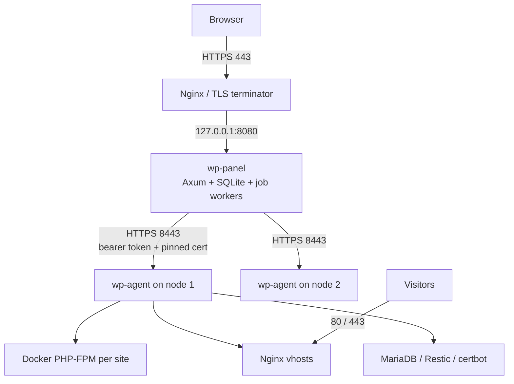

# WPressForge / WP Panel — Production Deployment Guide

This guide takes a clean pair of hosts (one control plane, one node) to a
running, hardened, production WordPress hosting platform. It is written against
the code in this repository: every env var, path, port and behaviour below is
read from `crates/panel/src/config.rs`, `crates/agent/src/config.rs`,
`deploy/systemd/*.service` and `deploy/install-agent.sh`.

> **Operational runbooks** (backup/restore, agent upgrades, triage) live in
> [`OPERATIONS.md`](./OPERATIONS.md). This document covers *getting it running
> safely the first time*.

---

## Table of contents

1. [Architecture and trust model](#1-architecture-and-trust-model)
2. [What you need before you start](#2-what-you-need-before-you-start)
3. [Network and firewall matrix](#3-network-and-firewall-matrix)
4. [Deploy the panel (control plane)](#4-deploy-the-panel-control-plane)
5. [Terminate TLS for the panel](#5-terminate-tls-for-the-panel)
6. [Deploy the node agent](#6-deploy-the-node-agent)
7. [Attach the node and create the first site](#7-attach-the-node-and-create-the-first-site)
8. [Production hardening checklist](#8-production-hardening-checklist)
9. [Backup and disaster recovery](#9-backup-and-disaster-recovery)
10. [Upgrades](#10-upgrades)
11. [Monitoring and health checks](#11-monitoring-and-health-checks)
12. [Troubleshooting](#12-troubleshooting)
13. [Reference: file layout, ports, environment variables](#13-reference-file-layout-ports-environment-variables)

---

## 1. Architecture and trust model



Two independently deployable binaries:

| Component | Runs as | Holds state | Talks to |
| --- | --- | --- | --- |
| `wp-panel` | unprivileged user `wp-panel` | SQLite + `secret.key` under `/var/lib/wp-panel` | agents over HTTP; browsers over HTTPS (via your reverse proxy) |
| `wp-agent` | `root` on each node | `/var/lib/wp-agent/state.json`, TLS key | the panel only |

**The panel never runs shell commands on a node.** It issues typed operations
defined in `crates/common/src/protocol.rs`; the agent validates, builds argument
vectors (never shell strings) and executes.

**Trust is established two ways:**

- A **shared bearer token** (`WP_AGENT_TOKEN`) on every agent request.
- **TLS certificate pinning.** The panel refuses to attach an `https://` agent
  without a SHA-256 fingerprint, and refuses `http://` to anything that is not
  loopback. The agent generates a self-signed certificate on first start and
  logs its fingerprint.

---

## 2. What you need before you start

### Hosts

| Host | Recommended spec | OS |
| --- | --- | --- |
| **Panel** | 2 vCPU, 2 GB RAM, 20 GB SSD | Any Linux with systemd. The panel is a static Rust binary; it does not need Docker. |
| **Node** (each) | 4+ vCPU, 8+ GB RAM, NVMe, capacity for `public_html` + DB + Docker images | Ubuntu 24.04 LTS or Debian 12 (the only OSes `install-agent.sh` targets) |

Panel and node **must not be the same host** in production. The node's agent
runs as root and manages the host's firewall, Nginx and Docker; co-locating the
public-facing panel with it removes the isolation that makes the design safe.

### Software

**Panel host**

- Rust toolchain (or cross-compiled binaries) — build with the current stable
  toolchain. `rustc`/`cargo` are the only build dependencies.
- `sqlite3` CLI (for backups and inspection).
- Nginx (or another reverse proxy) + `certbot` for TLS.

**Node host**

- Nothing pre-installed. `deploy/install-agent.sh` installs Docker, Nginx,
  MariaDB, Restic, certbot and UFW.

### DNS and certificates

- A public hostname for the panel, e.g. `panel.example.com`, resolving to the
  panel host.
- A wildcard or per-site DNS plan for the managed sites. Each WordPress site
  needs its own public hostname (e.g. `client.example.com`) pointing at the
  node, so Let's Encrypt HTTP-01 validation can succeed.

### Build the release binaries

On a build machine (or the panel host) from the repository root:

```bash
cargo build --release --workspace
ls -lh target/release/wp-panel target/release/wp-agent
```

`templates/` is compiled into both binaries. `static/` is served from disk and
must be shipped alongside `wp-panel`.

---

## 3. Network and firewall matrix

| From | To | Port | Protocol | Purpose |
| --- | --- | --- | --- | --- |
| Internet | Panel host | 80, 443 | TCP | Panel UI/API + ACME |
| Internet | Node host | 80, 443 | TCP | Hosted WordPress traffic + ACME |
| Panel host | Node host | **8443** | TCP | Agent operations API |
| Operators | Panel host | 22 | TCP | SSH administration |

**Never expose `8443` to the internet.** Restrict it to the panel's IP:

```bash
# On the node: allow only the panel
ufw allow from <PANEL_IP> to any port 8443 proto tcp
```

If the panel and node share a private network (VPC, WireGuard, Tailscale),
bind the agent to that private interface instead:

```bash
WP_AGENT_BIND=10.0.0.5:8443
```

and still keep the UFW rule in place as defence in depth.

---

## 4. Deploy the panel (control plane)

### 4.1 Create the service account and directories

The shipped unit runs as `wp-panel` with `ProtectSystem=strict` and the **only**
writable path being `/var/lib/wp-panel`. The SQLite database and encryption key
therefore must live under that directory.

```bash
sudo useradd --system --no-create-home --shell /usr/sbin/nologin wp-panel

sudo install -d -o wp-panel -g wp-panel -m 0750 /opt/wp-panel
sudo install -d -o wp-panel -g wp-panel -m 0750 /opt/wp-panel/static
sudo install -d -o wp-panel -g wp-panel -m 0750 /var/lib/wp-panel/data
sudo install -d -o root     -g root     -m 0750 /etc/wp-panel
```

### 4.2 Install the binary and static assets

```bash
sudo install -o wp-panel -g wp-panel -m 0755 target/release/wp-panel /opt/wp-panel/wp-panel
sudo cp -r static/. /opt/wp-panel/static/
sudo chown -R wp-panel:wp-panel /opt/wp-panel/static
```

### 4.3 Generate the secrets encryption key

Destination credentials (S3 keys, Restic passwords) are sealed with AES-256-GCM.
The key comes from `WP_PANEL_SECRET_KEY` (base64 of exactly 32 bytes) or, if
unset, from `<db_dir>/secret.key`, generated on first boot with mode `0600`.

**Generate it explicitly** so it exists before the first start and can be backed
up independently of the database:

```bash
openssl rand -base64 32
```

Store that value in your secret manager, and put it in `panel.env` below.

> ⚠️ **If this key is lost, every stored destination credential becomes
> undecryptable.** Back it up separately from the database, then never rotate it
> casually.

### 4.4 Write `/etc/wp-panel/panel.env`

```bash
sudo install -m 0600 /dev/null /etc/wp-panel/panel.env
sudo tee /etc/wp-panel/panel.env >/dev/null <<'EOF'
# ---------------------------------------------------------------- binding
WP_PANEL_BIND=127.0.0.1:8080

# ---------------------------------------------------------------- storage
# Must stay under /var/lib/wp-panel: the systemd unit makes everything else read-only.
WP_PANEL_DB=/var/lib/wp-panel/data/panel.db
WP_PANEL_STATIC=/opt/wp-panel/static

# ---------------------------------------------------------------- secrets
# base64 of 32 random bytes; `openssl rand -base64 32`
WP_PANEL_SECRET_KEY=REPLACE_WITH_GENERATED_KEY

# ---------------------------------------------------------------- bootstrap admin
# Created on first run only. If WP_PANEL_ADMIN_PASSWORD is unset, a random
# password is generated and logged ONCE by the panel.
WP_PANEL_ADMIN_EMAIL=admin@example.com
WP_PANEL_ADMIN_PASSWORD=REPLACE_WITH_A_STRONG_PASSWORD

# ---------------------------------------------------------------- production flags
# No example servers/sites, no simulated jobs.
WP_PANEL_DEMO_DATA=false
# The panel is behind HTTPS, so cookies must be Secure.
WP_PANEL_SECURE_COOKIES=true
WP_PANEL_WORKERS=4

# ---------------------------------------------------------------- outbound mail
# With no host set, invitation emails are written to the log instead of sent.
WP_PANEL_SMTP_HOST=smtp.example.com
WP_PANEL_SMTP_PORT=587
WP_PANEL_SMTP_USER=panel@example.com
WP_PANEL_SMTP_PASSWORD=REPLACE_WITH_SMTP_PASSWORD
WP_PANEL_SMTP_FROM=wp-panel@example.com

# ---------------------------------------------------------------- logging
WP_PANEL_LOG=info,sqlx=warn,tower_http=info
EOF

sudo chmod 0600 /etc/wp-panel/panel.env
```

Every panel flag has an env equivalent; the full list is in
[§13](#13-reference-file-layout-ports-environment-variables) and `.env.example`.

### 4.5 Install the systemd unit

```bash
sudo cp deploy/systemd/wp-panel.service /etc/systemd/system/wp-panel.service
sudo systemctl daemon-reload
sudo systemctl enable --now wp-panel
```

The unit already applies a strong sandbox:

```
NoNewPrivileges=yes         ProtectSystem=strict
PrivateTmp=yes              ProtectHome=yes
PrivateDevices=yes          ReadWritePaths=/var/lib/wp-panel
RestrictAddressFamilies=AF_INET AF_INET6 AF_UNIX
MemoryDenyWriteExecute=yes  SystemCallFilter=@system-service
```

If you change `WP_PANEL_DB` away from `/var/lib/wp-panel`, add the new parent to
`ReadWritePaths` or the panel will fail to open its database.

### 4.6 First start and admin account

```bash
sudo systemctl status wp-panel
sudo journalctl -u wp-panel -n 50 --no-pager
```

If you did **not** set `WP_PANEL_ADMIN_PASSWORD`, capture the generated one now —
it is logged exactly once, at `WARN`:

```bash
sudo journalctl -u wp-panel | grep -i "created the initial admin account"
```

Then remove the password from `panel.env` (if you hard-coded one) and restart so
it is not left lying in a file.

### 4.7 Verify locally before putting it on the internet

```bash
curl -fsS http://127.0.0.1:8080/healthz        # -> ok
curl -fsS -o /dev/null -w '%{http_code}\n' http://127.0.0.1:8080/static/css/app.css
curl -fsS -o /dev/null -w '%{http_code}\n' http://127.0.0.1:8080/login   # -> 200
```

Migrations run automatically on startup. An interrupted job is marked failed on
restart rather than silently vanishing — an intentional design choice.

---

## 5. Terminate TLS for the panel

The panel binds loopback by design; a reverse proxy terminates TLS. The panel
responds with Brotli/gzip and serves `/static` from disk, so keep proxy
compression off and pass everything through.

### 5.1 Obtain a certificate

```bash
sudo apt-get install -y nginx certbot
sudo install -d -m 0755 /var/www/acme
sudo certbot certonly --webroot -w /var/www/acme -d panel.example.com --email ops@example.com --agree-tos -n
```

### 5.2 Nginx vhost

```nginx
# /etc/nginx/sites-available/wp-panel.conf
server {
    listen 80;
    listen [::]:80;
    server_name panel.example.com;

    location /.well-known/acme-challenge/ { root /var/www/acme; }
    location / { return 301 https://$host$request_uri; }
}

server {
    listen 443 ssl;
    listen [::]:443 ssl;
    http2 on;                       # nginx 1.25.1+; use `listen 443 ssl http2;` below that
    server_name panel.example.com;

    ssl_certificate     /etc/letsencrypt/live/panel.example.com/fullchain.pem;
    ssl_certificate_key /etc/letsencrypt/live/panel.example.com/privkey.pem;
    ssl_protocols TLSv1.2 TLSv1.3;
    ssl_prefer_server_ciphers off;
    ssl_session_cache shared:SSL:10m;

    # Import uploads / WP-CLI console output can be large.
    client_max_body_size 64m;

    add_header Strict-Transport-Security "max-age=31536000; includeSubDomains" always;

    location / {
        proxy_pass http://127.0.0.1:8080;
        proxy_http_version 1.1;
        proxy_set_header Host              $host;
        proxy_set_header X-Real-IP         $remote_addr;
        proxy_set_header X-Forwarded-For   $proxy_add_x_forwarded_for;
        proxy_set_header X-Forwarded-Proto $scheme;
        proxy_set_header X-Forwarded-Host  $host;

        # Long-running operations stream progress; give them room.
        proxy_read_timeout 300s;
        proxy_send_timeout 300s;

        # Do not let the proxy add its own compression on top of the panel's.
        proxy_set_header Accept-Encoding "";
    }
}
```

```bash
sudo ln -sf /etc/nginx/sites-available/wp-panel.conf /etc/nginx/sites-enabled/
sudo nginx -t && sudo systemctl reload nginx
```

### 5.3 Certificate renewal

```bash
sudo systemctl enable --now certbot.timer
sudo certbot renew --dry-run
```

### 5.4 Firewall

```bash
sudo ufw allow 80/tcp
sudo ufw allow 443/tcp
sudo ufw allow 22/tcp
sudo ufw enable
```

`8080` stays bound to loopback and is never opened.

---

## 6. Deploy the node agent

### 6.1 Prerequisite: a token from the panel

Create an **API token** in the panel UI first (used to authenticate the agent to
the panel's attach flow), and decide on the agent's shared secret. Generate it
with real entropy — the agent has no rate limiting of its own:

```bash
openssl rand -hex 32      # -> WP_AGENT_TOKEN
```

### 6.2 Automated install

Copy `deploy/` and the built `wp-agent` to the node, preserving the layout:

```text
/root/wpressforge/
├── install-agent.sh
├── docker/php-fpm/{Dockerfile,php.ini,www.conf}
├── nginx/wp-panel-global.conf
├── systemd/wp-agent.service
└── target/release/wp-agent
```

Then:

```bash
sudo WP_AGENT_TOKEN='<your-32-byte-hex-token>' \
     WP_AGENT_BIND='0.0.0.0:8443' \
     WP_AGENT_ACME_EMAIL='ops@example.com' \
     NGINX_MAINLINE=true \
     ./install-agent.sh
```

The script:

1. Installs Docker, Nginx, MariaDB, Restic, certbot and UFW.
2. Optionally installs mainline Nginx (`NGINX_MAINLINE=true`) — required for
   HTTP/3 and the `http2` directive. The distro versions (Debian 12: 1.22,
   Ubuntu 24.04: 1.24) work but render the compat dialect.
3. Creates `/var/www`, `/var/www/acme`, `/var/cache/nginx`, `/var/lib/wp-agent`.
4. Installs the global Nginx config (`limit_req`/`limit_conn` zones, ACME
   webroot, default-server that returns `444` for unknown hosts).
5. Builds the PHP-FPM images `wp-panel/php-fpm:{8.2,8.3,8.4}`.
6. Installs `wp-agent`, writes `/etc/wp-panel/agent.env` (mode `0600`), enables
   the systemd unit.
7. Opens 80/443 in UFW and prints the agent certificate fingerprint.

**The agent starts in dry-run mode.** This is deliberate: a fresh install cannot
damage a host by accident.

### 6.3 Review `/etc/wp-panel/agent.env`

The installer writes a sane baseline. Verify it looks like this:

```bash
sudo cat /etc/wp-panel/agent.env
```

```env
WP_AGENT_BIND=0.0.0.0:8443
WP_AGENT_TOKEN=<secret>
WP_AGENT_SITES_ROOT=/var/www
WP_AGENT_NGINX_DIR=/etc/nginx/sites-enabled
WP_AGENT_CACHE_ROOT=/var/cache/nginx
WP_AGENT_STATE=/var/lib/wp-agent/state.json
WP_AGENT_UID_BASE=10001
WP_AGENT_DRY_RUN=true
WP_AGENT_RESTIC_REPO=s3:s3.amazonaws.com/my-wp-backups
WP_AGENT_ACME_EMAIL=ops@example.com
WP_AGENT_LOG=info
```

| Variable | Notes |
| --- | --- |
| `WP_AGENT_UID_BASE` | First Linux UID handed to sites. Ensure the range does not collide with real users; each site consumes the next free UID. |
| `WP_AGENT_RESTIC_REPO` | Default Restic repository. Per-site destinations configured in the panel override this. |
| `WP_AGENT_ACME_EMAIL` | Let's Encrypt registration contact. Keep it valid — expiry notices go here. |
| `WP_AGENT_TLS_CERT` / `WP_AGENT_TLS_KEY` | Leave unset to use the generated self-signed pair, or point at real certs. |

### 6.4 Capture the certificate fingerprint

The agent generates a self-signed certificate on first start, persisted as
`/var/lib/wp-agent/agent.crt` + `agent.key` (key mode `0600`), so the
fingerprint is stable across restarts.

```bash
sudo systemctl status wp-agent
sudo journalctl -u wp-agent | grep -i fingerprint
# -> self-signed TLS certificate generated — paste the fingerprint into the panel

# Or compute it directly:
sudo openssl x509 -in /var/lib/wp-agent/agent.crt -noout -fingerprint -sha256
```

The panel accepts the fingerprint as 64 hex characters, with or without colons
and with or without the `sha256:` prefix.

### 6.5 Confirm the capability probe

The agent probes `nginx -V` at startup and renders only directives the installed
binary understands (`http2 on;` vs `listen ... http2`, HTTP/3 only with
`--with-http_v3_module`, brotli only with `ngx_brotli`, otherwise
`gzip_static`). Check what it saw:

```bash
sudo journalctl -u wp-agent | grep -iA5 'capabilit\|nginx'
nginx -v 2>&1
```

### 6.6 Dry-run shakedown (do not skip)

Leave `WP_AGENT_DRY_RUN=true` and drive a few operations from the panel — create
a site, switch PHP, create a backup. Then read exactly what *would* have run:

```bash
sudo journalctl -u wp-agent -n 200 --no-pager
```

Confirm:

- Commands are argument vectors, never concatenated shell strings.
- No passwords appear in the log (the agent redacts WordPress, Restic and MySQL
  passwords).
- Nginx config paths and PHP image tags are what you expect.

Only when you are satisfied:

```bash
sudo sed -i 's/^WP_AGENT_DRY_RUN=true/WP_AGENT_DRY_RUN=false/' /etc/wp-panel/agent.env
sudo systemctl restart wp-agent
```

### 6.7 Firewall

The installer already allowed 80/443. Add the panel-only rule for 8443:

```bash
sudo ufw allow from <PANEL_IP> to any port 8443 proto tcp
sudo ufw status verbose
```

---

## 7. Attach the node and create the first site

1. Sign in to `https://panel.example.com` as the bootstrap admin.
2. Go to **Servers → Attach server** and fill in:
   - **Agent URL**: `https://<node-host>:8443` (a hostname matching the
     certificate SANs, or the node IP).
   - **Agent fingerprint**: the `sha256:...` value from §6.4. Required for any
     `https://` URL — the panel rejects an unpinned HTTPS agent with `422`.
   - **Token**: the `WP_AGENT_TOKEN` you installed with.
3. The server should turn **online** and report the agent version. A wrong
   fingerprint fails the TLS handshake and the server is marked offline — that
   is the pinning working as intended.
4. Create a site: **Sites → New site**. Give it the domain you pointed at the
   node. Pick a PHP version (the images built in §6.2 are `8.2`, `8.3`, `8.4`).
5. Follow the job in **Jobs** — every step is reported live. Provisioning runs
   the certificate issuance, vhost render, container start and health check.
6. Visit `https://<site-domain>` and complete the WordPress installer.

> **Shakedown note.** The project's own status document is candid: node
> operations have been exercised with `WP_AGENT_DRY_RUN=true` plus real
> `nginx -t` validation, but the first run against live Docker, MariaDB and
> certbot still needs a shakedown. Do the first site on a **staging node**, with
> console access, before you trust the platform with client work.

---

## 8. Production hardening checklist

### Panel

- [ ] `WP_PANEL_DEMO_DATA=false` — no example servers or simulated jobs.
- [ ] `WP_PANEL_SECURE_COOKIES=true` — the UI is behind HTTPS.
- [ ] `WP_PANEL_SECRET_KEY` set explicitly and stored in a secret manager.
- [ ] `WP_PANEL_ADMIN_PASSWORD` removed from `panel.env` after the first start.
- [ ] `/etc/wp-panel/panel.env` mode `0600`, owned by root.
- [ ] Enable **TOTP 2FA** for every administrator account.
- [ ] Issue scoped **API tokens** for automation; revoke on offboarding.
- [ ] Review **login throttling** is active (it is on by default) and monitor
      `Audit` for repeated failures.
- [ ] `/healthz` reachable only from your monitoring, not the public internet
      (or accept the `ok` string — it leaks nothing).
- [ ] HSTS enabled at the proxy (see §5.2).

### Nodes

- [ ] Agent port 8443 reachable **only** from the panel IP.
- [ ] `WP_AGENT_DRY_RUN=false` only after the shakedown in §6.6.
- [ ] `/etc/wp-panel/agent.env` mode `0600`, owned by root.
- [ ] Confirm redaction: `journalctl -u wp-agent | grep -i password` returns
      nothing sensitive.
- [ ] `WP_AGENT_ACME_EMAIL` valid so expiry notices are delivered.
- [ ] Unattended security upgrades for the host OS.
- [ ] Monitor disk: images, `public_html`, MariaDB and Restic cache all live here.
- [ ] Docker log rotation configured (Docker's default json-file log grows
      unbounded).
- [ ] Document the `WP_AGENT_UID_BASE` range so it is never reused for a real user.

### Secrets handling

- [ ] `secret.key` / `WP_PANEL_SECRET_KEY` backed up **separately** from the DB.
- [ ] Agent tokens unique per node, so one node's compromise does not open the fleet.
- [ ] Restic repository passwords stored in the panel's destinations, not on the node.

---

## 9. Backup and disaster recovery

Full procedures are in [`OPERATIONS.md`](./OPERATIONS.md) §2–§3. The minimum you
must have:

**Panel (defines your whole estate):**

```bash
# Transactionally safe online backup of a running panel.
sqlite3 /var/lib/wp-panel/data/panel.db ".backup '/var/backups/panel/panel-$(date +%F-%H%M%S).db'"
cp /var/lib/wp-panel/data/secret.key /var/backups/panel/secret.key
```

Then encrypt and ship offsite. A panel backup **without** `secret.key` cannot
restore your destination credentials.

**Sites:** Restic snapshots written from the node straight to your object
storage (S3, R2, B2, Wasabi, MinIO). Configure destinations and per-site
schedules in **Settings → Destinations** / **Site → Backup schedule**. Retention
defaults to `--keep-hourly 24 --keep-daily 7 --keep-weekly 4 --keep-monthly 6`.

**Recovery order:** restore the panel host (binary + `panel.db` + `secret.key`)
→ re-attach each node (fingerprints are stable, so the same pin works) → restore
sites from Restic, either through the UI or with the out-of-band `restic` CLI
procedure in `OPERATIONS.md` §3.4.

**Test it.** A backup you have never restored is a hypothesis. Restore one site
to a scratch node each quarter.

---

## 10. Upgrades

### Panel

The panel owns the database, so upgrade it first; migrations run on startup.

```bash
# On the build machine
cargo build --release --workspace

# Ship and swap
sudo systemctl stop wp-panel
sudo install -m 0755 target/release/wp-panel /opt/wp-panel/wp-panel
sudo cp -r static/. /opt/wp-panel/static/
sudo chown -R wp-panel:wp-panel /opt/wp-panel/static
sudo systemctl start wp-panel
sudo journalctl -u wp-panel -n 30 --no-pager
```

Take a database backup (§9) immediately before every upgrade. There is no
downgrade path once migrations have run.

### Agents

Rolling, node by node. **Restarting `wp-agent` does not interrupt HTTP traffic** —
Nginx and the PHP-FPM containers run independently.

```bash
scp target/release/wp-agent admin@node1:/tmp/wp-agent.new
ssh admin@node1 'chmod +x /tmp/wp-agent.new && /tmp/wp-agent.new --version'
ssh admin@node1 'sudo install -m 0755 /tmp/wp-agent.new /usr/local/bin/wp-agent && sudo systemctl restart wp-agent'
```

Then confirm the node is green in **Servers** and that metrics resume within
30 seconds before moving to the next node.

**Certificate rotation:** if you regenerate the agent certificate, the
fingerprint changes. Update the pinned value in the panel's server record before
the node is expected to reconnect (`OPERATIONS.md` §4.2).

---

## 11. Monitoring and health checks

| What | How |
| --- | --- |
| Panel liveness | `GET /healthz` on `127.0.0.1:8080` → `ok` |
| Agent reachability | The **Servers** page shows online/offline; the panel heartbeats each node |
| Node metrics | **Server → Metrics**: CPU, RAM, disk history with sparklines |
| Alerts | Configured in-panel; delivered in-app and by SMTP when `WP_PANEL_SMTP_*` is set |
| Job failures | **Jobs → list**; interrupted jobs are marked failed on panel restart |
| Agent logs | `journalctl -u wp-agent -f` |
| Panel logs | `journalctl -u wp-panel -f` |

Suggested external probes: HTTPS `200` on the panel login page, TCP `8443` from
the panel to each node, disk space on both roles, and certificate expiry for the
panel and each site.

---

## 12. Troubleshooting

| Symptom | Likely cause | Check | Fix |
| --- | --- | --- | --- |
| Panel won't start; permission denied on the DB | DB path outside `/var/lib/wp-panel` with `ProtectSystem=strict` | `journalctl -u wp-panel -n 50` | Move the DB under `/var/lib/wp-panel`, or extend `ReadWritePaths` |
| `invalid WP_PANEL_SECRET_KEY` at boot | Not base64, or not exactly 32 bytes | `journalctl -u wp-panel` | Regenerate with `openssl rand -base64 32` |
| Cannot attach a server; `422` | Unpinned `https://`, or plain `http://` to a non-loopback host | The error text in the attach form | Paste the agent's `sha256:` fingerprint, or use `https://` |
| Server shows offline after attaching | Wrong fingerprint, or 8443 blocked | `journalctl -u wp-agent`, `ufw status`, `openssl s_client -connect <node>:8443` | Re-pin the current fingerprint; open 8443 to the panel IP |
| Agent refuses to start: `token` missing | `WP_AGENT_TOKEN` unset | `systemctl status wp-agent` | Set it in `/etc/wp-panel/agent.env` and restart |
| Changes don't happen on the node | Still in dry-run | `grep DRY_RUN /etc/wp-panel/agent.env` | Set `WP_AGENT_DRY_RUN=false` after reviewing the log |
| `502 Bad Gateway` on a site | PHP-FPM container stopped or unhealthy | `docker ps -a` | Restart the site from the panel; check the site's resource limits |
| Certificate issuance fails | DNS not pointed at the node, or port 80 blocked | `dig +short <domain>`, `ufw status` | Fix DNS/port 80; retry from the site's SSL tab |
| Destination "test" fails | Restic repo unreachable or credentials wrong | **Settings → Destinations** error text | Re-check keys; the panel decrypts them with `secret.key` |
| Stored credentials unusable after a move | `secret.key` was not migrated | — | Restore the original key; sealed values cannot be recovered without it |

---

## 13. Reference: file layout, ports, environment variables

### Paths — panel host

| Path | Purpose |
| --- | --- |
| `/opt/wp-panel/wp-panel` | Panel binary |
| `/opt/wp-panel/static/` | CSS/JS/vendored HTMX, served at `/static` |
| `/etc/wp-panel/panel.env` | Environment file (`0600`) |
| `/var/lib/wp-panel/data/panel.db` | SQLite database (+ `-wal`, `-shm`) |
| `/var/lib/wp-panel/data/secret.key` | Generated AES-256-GCM key (`0600`) |
| `/etc/systemd/system/wp-panel.service` | Systemd unit |

### Paths — node

| Path | Purpose |
| --- | --- |
| `/usr/local/bin/wp-agent` | Agent binary |
| `/etc/wp-panel/agent.env` | Environment file (`0600`) |
| `/var/www/<domain>/` | Site root, owned by a dedicated UID from `WP_AGENT_UID_BASE` |
| `/var/www/acme/` | ACME HTTP-01 webroot |
| `/etc/nginx/sites-enabled/<domain>.conf` | Generated vhosts |
| `/etc/nginx/conf.d/wp-panel-global.conf` | Limit zones + default server |
| `/var/cache/nginx/<domain_underscored>/` | FastCGI cache, one per site |
| `/var/lib/wp-agent/state.json` | Agent's index of managed sites |
| `/var/lib/wp-agent/agent.crt`, `agent.key` | Self-signed TLS pair (`0600` key) |

### Ports

| Port | Host | Exposure |
| --- | --- | --- |
| `8080` | Panel | Loopback only |
| `8443` | Node | Panel IP only |
| `80`, `443` | Both | Public |

### Panel environment variables

Read from `crates/panel/src/config.rs`. Defaults shown.

| Variable | Default | Notes |
| --- | --- | --- |
| `WP_PANEL_BIND` | `127.0.0.1:8080` | Keep on loopback behind a proxy |
| `WP_PANEL_DB` | `data/panel.db` | Under `/var/lib/wp-panel` in production |
| `WP_PANEL_STATIC` | `static` | Serve from `/opt/wp-panel/static` |
| `WP_PANEL_ADMIN_EMAIL` | `admin@localhost` | Bootstrap admin, first run only |
| `WP_PANEL_ADMIN_PASSWORD` | *(generated)* | If unset, logged once at `WARN` |
| `WP_PANEL_DEMO_DATA` | `true` | **Set `false` in production** |
| `WP_PANEL_WORKERS` | `4` | Concurrent job workers |
| `WP_PANEL_SECURE_COOKIES` | `false` | **Set `true` behind HTTPS** |
| `WP_PANEL_SECRET_KEY` | *(from `secret.key`)* | base64, 32 bytes |
| `WP_PANEL_SMTP_HOST` | *(none)* | Unset ⇒ invitation mail goes to the log |
| `WP_PANEL_SMTP_PORT` | `587` | |
| `WP_PANEL_SMTP_USER` | *(none)* | |
| `WP_PANEL_SMTP_PASSWORD` | *(none)* | |
| `WP_PANEL_SMTP_FROM` | *(none)* | e.g. `wp-panel@example.com` |
| `WP_PANEL_LOG` | `info,sqlx=warn,tower_http=info` | `tracing` `EnvFilter` syntax |

### Agent environment variables

Read from `crates/agent/src/config.rs`. Defaults shown.

| Variable | Default | Notes |
| --- | --- | --- |
| `WP_AGENT_BIND` | `127.0.0.1:8443` | Private interface or panel-IP-restricted |
| `WP_AGENT_TOKEN` | — | **Required.** High-entropy shared secret |
| `WP_AGENT_SITES_ROOT` | `/var/www` | Per-site directories |
| `WP_AGENT_NGINX_DIR` | `/etc/nginx/sites-enabled` | Where vhosts are written |
| `WP_AGENT_CACHE_ROOT` | `/var/cache/nginx` | FastCGI cache root |
| `WP_AGENT_STATE` | `/var/lib/wp-agent/state.json` | Also the home of the TLS pair |
| `WP_AGENT_UID_BASE` | `10001` | First UID allocated to a site |
| `WP_AGENT_DRY_RUN` | `true` | **Defaults to on.** Flip after shakedown |
| `WP_AGENT_RESTIC_REPO` | *(none)* | Default backup target |
| `WP_AGENT_ACME_EMAIL` | *(none)* | Let's Encrypt contact |
| `WP_AGENT_TLS_CERT` / `WP_AGENT_TLS_KEY` | *(none)* | Unset ⇒ self-signed pair |
| `WP_AGENT_TLS_SELF_SIGNED` | `false` | Force regeneration |
| `WP_AGENT_LOG` | — | `tracing` `EnvFilter` syntax |

### Quality gates before you ship a build

```bash
cargo fmt --check
cargo clippy --workspace --all-targets -- -D warnings
cargo test --workspace
just test-nginx        # renders both Nginx dialects and runs `nginx -t` locally
```

Run `just test-nginx` on every OS/distro you intend to support — it validates
the generated vhosts against the Nginx actually installed on that machine.
