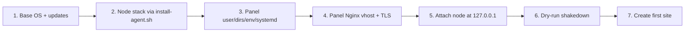

# Single-Host Deployment: Panel + Agent on One Server

**Can one big box (e.g. 64 GB RAM / 1 TB SSD) run the panel *and* host the
WordPress sites it manages?** Yes. Nothing in the code requires the control
plane and the node to be separate machines. This document covers what I verified
in the source, the handful of things you must do differently, and the trade-offs
you are accepting.

Read [`DEPLOYMENT.md`](./DEPLOYMENT.md) first — this document only describes the
deltas for the all-in-one topology.

---

## 1. Findings from the code

### 1.1 Nothing blocks co-location

The panel is a generic HTTP client to *any* agent URL. There is no concept of a
"local node" and no check that the agent is remote:

- `crates/panel/src/agent.rs` builds a pinned TLS client per fingerprint and
  sends the same typed operations regardless of address.
- `crates/panel/src/web/servers.rs` validates only that the URL is `https://`
  with a fingerprint, **or** `http://` on a loopback host
  (`127.0.0.1` / `[::1]` / `localhost`).
- The panel's systemd sandbox (`RestrictAddressFamilies=AF_INET AF_INET6
  AF_UNIX`) permits outbound loopback connections. `ProtectSystem=strict` only
  restricts the filesystem, not the network.

### 1.2 The agent always speaks TLS — even on loopback

`crates/agent/src/main.rs` unconditionally binds with
`axum_server::bind_rustls(...)`. There is no plain-HTTP mode.

Consequence: the panel's "loopback plain HTTP is allowed" rule is a *validation*
rule, not a working path here. If you enter `http://127.0.0.1:8443`, the panel
will accept the form but the connection will fail, because the agent will not
speak plain HTTP back.

**Attach with `https://127.0.0.1:8443` and the pinned fingerprint.**

### 1.3 The pin ignores the hostname — so `127.0.0.1` attachment just works

`FingerprintVerifier::verify_server_cert` in `crates/panel/src/agent.rs` takes
`_server_name` and never inspects it. It compares only the SHA-256 of the leaf
certificate against the pin.

This matters because the agent's self-signed certificate is issued for the
system hostname plus the first non-loopback IPv4 address (`hostname()` /
`local_ip()` in `main.rs`) — **`127.0.0.1` is not a SAN**. Normally a name
mismatch would fail the handshake; with this verifier it does not. No certificate
regeneration is required.

### 1.4 Filesystem namespacing is already safe

Everything the agent destroys or owns is confined to its own roots:

| Component | Paths |
| --- | --- |
| Panel | `/opt/wp-panel`, `/var/lib/wp-panel`, `/etc/wp-panel/panel.env` |
| Sites | `/var/www/<domain>` (agent's `chown -R` / `rm -rf` targets) |
| Agent | `/var/lib/wp-agent`, `/etc/wp-panel/agent.env` |

`filesystem::remove_tree` only ever removes paths under `WP_AGENT_SITES_ROOT`.
There is no overlap with panel state. Keep the panel out of `/var/www`.

### 1.5 Nginx is shared, and it is fine — with two rules

The agent owns `/etc/nginx/sites-enabled` and installs
`/etc/nginx/conf.d/wp-panel-global.conf`, which the panel's own reverse proxy
also uses. They coexist because **named `server_name` blocks win over the
catch-all `default_server`**, which is exactly what the global config relies on
(unknown hosts get `return 444`).

Two rules to avoid self-inflicted breakage:

1. **Do not name the panel's vhost `default`.** `install-agent.sh` runs
   `rm -f /etc/nginx/sites-enabled/default`. Name it `wp-panel.conf`.
2. **Never create a managed site for the panel's own hostname.** The agent would
   overwrite the vhost serving the UI. Keep the panel on a hostname that is not
   a managed site (e.g. `panel.example.com`).

### 1.6 Shared MariaDB mode is the density-friendly default

`crates/agent/src/ops/database.rs` supports two modes:

- **Shared** — runs `mysql --protocol=socket -e "CREATE DATABASE ... CREATE USER ..."`
  against the host MariaDB and connects the site over `127.0.0.1`. One database
  server for the whole box. Use this.
- **Dedicated** — starts a `mariadb:11.4` container capped at **512 MB**, one per
  site. Correct for isolation, expensive for density.

### 1.7 Per-site containment is already production-grade

`ops/docker.rs` starts each site with `--user <uid>`, `--cpus`, `--memory` (+
matching `--memory-swap`, so swap cannot be used to escape the cap),
`--pids-limit 512`, `--cap-drop ALL`, `--read-only`, a `noexec` `/tmp` tmpfs, and
only that site's directories bind-mounted. Sites cannot see each other's files
even though they share a host.

---

## 2. What you must do differently

Only four things change versus the two-host guide:

| # | Change | Why |
| --- | --- | --- |
| 1 | `WP_AGENT_BIND=127.0.0.1:8443` | The installer defaults to `0.0.0.0:8443`. On a public box that exposes a root-privileged API to the internet. |
| 2 | Attach as `https://127.0.0.1:8443` + fingerprint | The agent is TLS-only; the pin makes the hostname mismatch irrelevant. |
| 3 | **No** UFW rule for 8443 | Loopback-only traffic never hits the firewall. Opening 8443 would defeat change #1. |
| 4 | Panel vhost in `sites-enabled` but **not** named `default`, on a hostname that is not a managed site | See §1.5. |

Everything else — service accounts, `panel.env`, `agent.env`, the systemd units,
the reverse proxy — is identical to `DEPLOYMENT.md` §4 and §5.

---

## 3. Install order



**Install the node stack first.** `install-agent.sh` creates `/var/www/acme`,
installs Nginx/MariaDB/Docker and lays down the global config that the panel's
own vhost will live alongside. Doing the panel first means fighting Nginx's
`default` site.

### 3.1 Node stack

```bash
sudo WP_AGENT_TOKEN='<at-least-24-chars-of-entropy>' \
     WP_AGENT_BIND='127.0.0.1:8443' \
     WP_AGENT_ACME_EMAIL='ops@example.com' \
     NGINX_MAINLINE=true \
     ./install-agent.sh
```

`NGINX_MAINLINE=true` is worth it here: it gives you HTTP/3 and the `http2 on;`
directive, and `just test-nginx` on this distro validates the generated vhosts
against the Nginx the agent will actually drive.

Leave `WP_AGENT_DRY_RUN=true` for now.

> The token must be **≥ 24 characters** or the agent refuses to start
> (`main.rs` hard-fails below that).

### 3.2 Panel

Follow `DEPLOYMENT.md` §4.1–§4.6 exactly. Only these values differ:

```env
WP_PANEL_BIND=127.0.0.1:8080
WP_PANEL_DB=/var/lib/wp-panel/data/panel.db
WP_PANEL_STATIC=/opt/wp-panel/static
WP_PANEL_DEMO_DATA=false
WP_PANEL_SECURE_COOKIES=true
```

### 3.3 Panel vhost

Use the config from `DEPLOYMENT.md` §5.2 with one change — the vhost file must
**not** be called `default`:

```bash
sudo ln -sf /etc/nginx/sites-available/wp-panel.conf /etc/nginx/sites-enabled/wp-panel.conf
```

Its ACME location can share the agent's webroot:

```nginx
location /.well-known/acme-challenge/ { root /var/www/acme; }
```

### 3.4 Firewall

```bash
sudo ufw allow 22/tcp
sudo ufw allow 80/tcp
sudo ufw allow 443/tcp
sudo ufw enable
sudo ufw status verbose     # 8443 must NOT appear
```

### 3.5 Attach the node

1. Fingerprint: `sudo journalctl -u wp-agent | grep -i fingerprint`
   (or `openssl x509 -in /var/lib/wp-agent/agent.crt -noout -fingerprint -sha256`).
2. **Servers → Attach server**:
   - Agent URL: `https://127.0.0.1:8443`
   - Fingerprint: the `sha256:...` value
   - Token: your `WP_AGENT_TOKEN`
3. Expect **online** with an agent version. A wrong pin fails the handshake and
   the node is marked offline — that is the pinning working.

### 3.6 Shakedown, then flip

Create a site and read the plan before letting it run:

```bash
sudo journalctl -u wp-agent -n 300 --no-pager
```

Confirm argument vectors (not shell strings), no cleartext passwords, expected
paths and PHP image tags. Then:

```bash
sudo sed -i 's/^WP_AGENT_DRY_RUN=true/WP_AGENT_DRY_RUN=false/' /etc/wp-panel/agent.env
sudo systemctl restart wp-agent
```

Then create the real first site and complete the WordPress installer.

---

## 4. Sizing a 64 GB / 1 TB box

| Consumer | Rough cost |
| --- | --- |
| Panel process | ~200–500 MB RSS, idle CPU |
| Host MariaDB (shared mode) | Budget 8–12 GB for the buffer pool on a 64 GB box |
| Docker runtime | 1–2 GB |
| Each PHP-FPM container | `site.limits.memory_mb`, set per site |
| Each site on disk | `public_html` + DB + `backups/` + Restic cache |

Practical guidance:

- Sum each site's `memory_mb` **plus** headroom for MariaDB. With ~1 GB per
  site, 64 GB supports roughly 40–50 concurrent-ish sites — but concurrency, not
  site count, is what consumes RAM. Small brochure sites can be far denser.
- **Do not** use dedicated database mode here; 512 MB per site evaporates RAM.
- `--read-only` containers with the site tree bind-mounted means disk I/O is
  direct, not overlayfs — good for 1 TB SSD.
- Everything shares one disk: `public_html`, MariaDB data, Restic cache, and
  Docker images. Watch `df -h` and set up the disk alert in the panel.
- **Rotate Docker logs.** Docker's default `json-file` driver grows unbounded and
  will silently eat the disk (`OPERATIONS.md` §5).

---

## 5. Trade-offs you are accepting

### 5.1 The trust boundary collapses

This is the significant one, and it is a design consequence, not a bug.

In the two-host topology the panel is internet-facing but **unprivileged**, and
the agent is privileged but **network-isolated**. On one box:

- The panel is public-facing.
- The agent is `root` on that same host.
- The panel's database holds sealed credentials **and** the encryption key.

A panel compromise becomes root on the host, which is every site, every
database, and every backup credential. A node exploit becomes the panel too.

Mitigations, roughly in order of value:

1. **Put the panel behind an IP allowlist or VPN.** If only you can reach it, the
   public attack surface shrinks to near zero. This is the single highest-value
   control and largely restores the isolation the two-host topology gives you
   for free.
2. Enforce **TOTP 2FA** on every admin account (M1 supports it).
3. Keep `WP_AGENT_BIND` on loopback (§2).
4. Don't co-tenant untrusted client sites with the panel if you can avoid it.
5. Consider running the panel in a container/VM on the box with its own
   network namespace, so panel compromise is not instantly root.

### 5.2 Single point of failure

One host means the panel and every site fail together, and rebooting for a
kernel update takes the control plane down with the sites. The two-host split
exists partly so you can patch nodes without losing the UI.

Accept it, or keep a small separate panel host. Note that the agent's certificate
pin is stable across restarts, so **migrating a node between topologies later is
cheap** — see §7.

### 5.3 Blast radius of agent bugs

The agent runs as root and manages the same filesystem as the panel. A defect in
an operation (a wrong path, a bad `rm -rf`) can now affect the control plane, not
just a remote node. This is why the dry-run shakedown in §3.6 matters more here
than it would elsewhere — and why the project's own status note (node operations
not yet exercised against live Docker/MariaDB/certbot) should be taken seriously
before you put client work on it.

---

## 6. Verification checklist

- [ ] `curl -fsS http://127.0.0.1:8080/healthz` → `ok` (panel)
- [ ] `curl -kfsS https://127.0.0.1:8443/healthz` → `ok` (agent; the route is
      unauthenticated, so `-k` plus the loopback URL is enough to prove the
      path is live before you attach)
- [ ] `sudo ss -ltnp | grep -E '8080|8443'` shows **both** bound to `127.0.0.1`
- [ ] `sudo ss -ltnp | grep -E ':80|:443'` shows Nginx bound to `0.0.0.0`/`[::]`
- [ ] `sudo ufw status` shows only 22/80/443
- [ ] `https://panel.example.com` loads over a valid certificate
- [ ] \*\*Servers\*\* shows the node **online** with the correct version
- [ ] A test site serves over HTTPS and survives
      `sudo systemctl restart wp-agent`
- [ ] `sudo journalctl -u wp-agent | grep -i password` leaks nothing
- [ ] A restore from Restic to a scratch directory succeeds

---

## 7. Splitting later (or adding more nodes)

The all-in-one box is a supported topology, not a one-way door:

1. Stand up a small panel host and deploy the panel there (`DEPLOYMENT.md` §4–§5).
2. Move `panel.db` and `secret.key` across; migrations are already applied.
3. On the original box, change `WP_AGENT_BIND` to a private address reachable
   only by the new panel, or set up WireGuard.
4. Re-enter the server in the new panel with **the same fingerprint** — it is
   derived from the persisted `/var/lib/wp-agent/agent.crt`, so the pin still
   matches and existing sites are untouched.
5. Add further nodes the same way; they appear as additional entries under
   **Servers** and can be site targets independently.

This gives you the best of both worlds: start on one box, then peel the control
plane off once you have more than one node or need the security separation.
